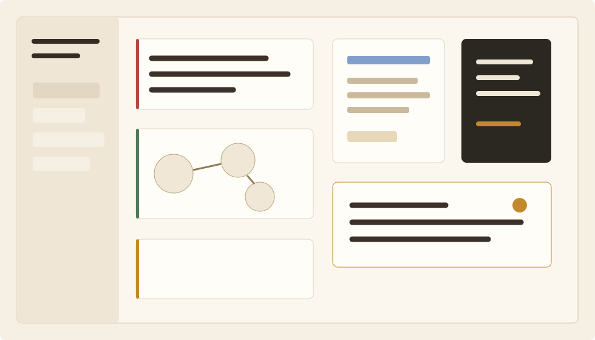

<a href="https://chronnote.top">
  <picture>
    <source media="(prefers-color-scheme: dark)" srcset="assets/logo-dark.png">
    
  </picture>
</a>

 

<picture>
  <source media="(prefers-color-scheme: dark)" srcset="assets/chronnote-title-dark.svg">
  
</picture>

 

**AI 驱动的本地优先知识笔记应用**

 

提问 -> 思考 -> 灵感。让笔记、PDF、白板、待办和 AI 一起成为你的长期思考系统。

 

---

> [!IMPORTANT]
> This is the public documentation and product-introduction repository for Chronnote. It does not contain Chronnote source code, private product internals, release signing materials, or infrastructure credentials.

## Chronnote 是什么

Chronnote 是一款面向深度知识工作的本地优先笔记应用。它把碎片资料、长文档阅读、白板推演、待办推进和 AI 辅助思考放在同一个工作空间里，让知识不只是被保存，而是持续被追问、组织和重新发现。

它适合这些场景：

- 研究论文、PDF、网页摘录和个人笔记之间需要长期关联
- 想把问题拆成材料、线索、判断和行动，而不是只得到一次性的 AI 回答
- 需要在本地优先的桌面环境里沉淀长期项目
- 希望 AI 帮你阅读、追问、整理和生成，但不替你做最终判断

## 产品气质

Chronnote 的设计语言是 **Delphi x Arena**：安静、克制、有研究感。我们更关心内容之间的关系，而不是花哨的界面效果。

- **本地优先**：重要资料首先属于你的工作空间
- **原子化知识**：笔记、PDF、白板、待办都可以成为可引用的知识单元
- **双向关联**：让想法和材料自然形成网络
- **AI 辅助思考**：AI 是解读者和协作者，不是替代判断的黑箱
- **桌面优先**：为长时间阅读、写作、比较和推演设计

  

## 快速入口

- 官网与下载：[chronnote.top](https://chronnote.top)
- 产品介绍：[docs/overview.md](docs/overview.md)
- 本地优先理念：[docs/local-first.md](docs/local-first.md)
- AI 与 Chron Engine：[docs/chron-engine.md](docs/chron-engine.md)
- 社群与反馈：[docs/community.md](docs/community.md)
- 常见问题：[docs/faq.md](docs/faq.md)

## 当前重点

Chronnote 正在围绕桌面端深度知识工作持续打磨：

- 笔记、PDF、白板、待办之间的资料关联
- 面向长文档的阅读、标注、摘录和结构导航
- 支持双向链接、反向引用和上下文检索
- 用 Chron Engine 将真实材料转化为可追问的思考上下文
- 更稳定、更克制、更适合长期使用的桌面体验

## Community

欢迎通过这些方式了解 Chronnote、反馈问题或交流使用案例：

- Website: [chronnote.top](https://chronnote.top)
- Email: [1155181470@link.cuhk.edu.hk](mailto:1155181470@link.cuhk.edu.hk)
- QQ group: [Join community](https://qm.qq.com/q/pAeSI78uVa)

## English

Chronnote is a local-first, AI-powered knowledge workspace for notes, PDFs, whiteboards, todos, and long-term thinking. This repository is a public documentation and product-introduction hub. It does not include Chronnote source code.

Start from [the official website](https://chronnote.top) or read the [English overview](docs/overview-en.md).
